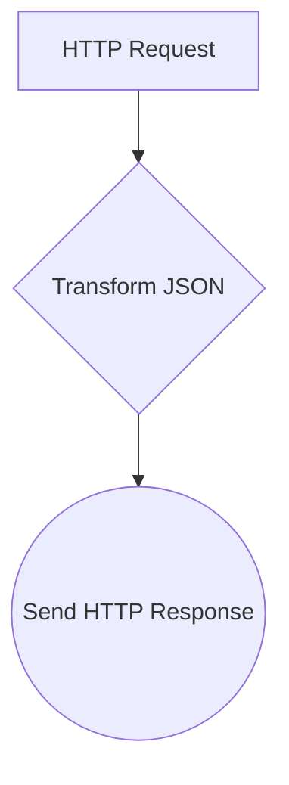
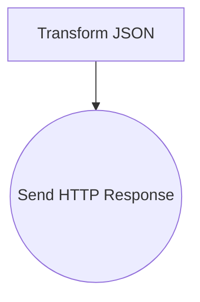
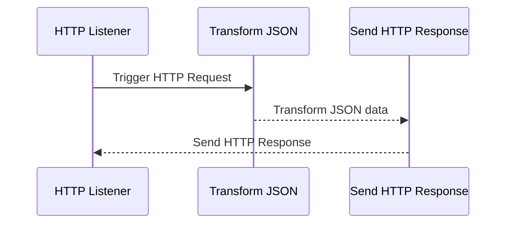
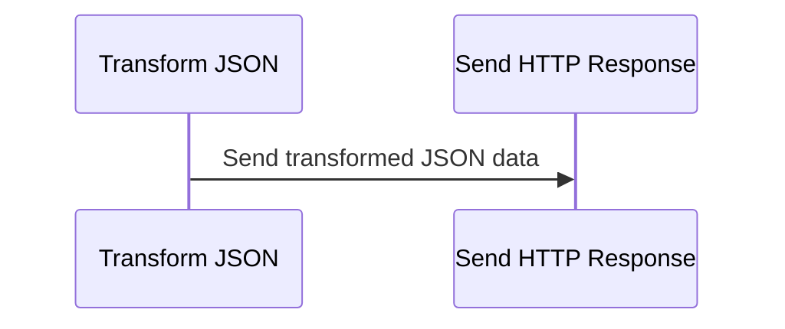

# Architecture Documentation

## 1. Introduction
This document provides an overview of the architecture for the integration using Azure Logic Apps. The integration consists of inbound and outbound Logic Apps that work together to transform JSON data and send an HTTP response.

### 1.1 Purpose
The purpose of this document is to outline the architecture of the integration, including the components involved, their interactions, and the flow of messages between them.

### 1.2 Scope
This document covers the overall architecture of the integration, including both inbound and outbound Logic Apps.

## 2. Business Context
In this section, we will visualize the business context of the integration using Mermaid graphs.

### 2.1 Inbound Business Context

### 2.2 Outbound Business Context

## 3. Structure and Behavior
This section describes the structure and behavior of the Logic Apps involved in the integration.

### 3.1 Inbound Logic App
The inbound Logic App consists of the following components:
- **Trigger:** HTTP Request trigger
- **Action:** Transform JSON action to concatenate first name and last name
- **Action:** Send HTTP Response action to send the transformed JSON data to an outbound endpoint

### 3.2 Outbound Logic App
The outbound Logic App consists of the following components:
- **Action:** Receive transformed JSON data from the inbound Logic App
- **Action:** Send HTTP Request to the specified outbound endpoint

## 4. Message Flow
In this section, we will illustrate the message flow between components using sequence diagrams.

### 4.1 Inbound Message Flow

### 4.2 Outbound Message Flow

## 5. Azure Resources
This section outlines the Azure resources used in the integration.

### 5.1 Inbound Resources
- **HTTP Request Trigger:** Receive incoming HTTP requests
- **Compose Action (Transform_JSON):** Transform and concatenate JSON data
- **HTTP Action (Send_HTTP_Response):** Send HTTP response with transformed data

### 5.2 Outbound Resources
- **Compose Action (Transform_JSON):** Receive transformed JSON data
- **HTTP Action (Send_HTTP_Response):** Send HTTP request to outbound endpoint

### 5.3 Azure Services Used
- Azure Logic Apps
- Azure HTTP Trigger
- Azure HTTP Action

## Conclusion
This documentation provides an overview of the architecture for the integration using Azure Logic Apps, including the components involved, message flow, and Azure resources utilized.